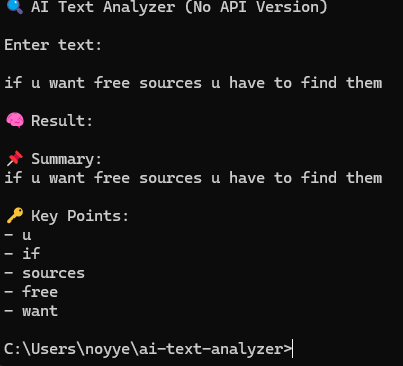

# 🤖 AI Text Analyzer

A beginner-friendly AI-style tool that analyzes text, generates summaries, and extracts key insights.

---

## 🚀 Features
- 📌 Text summarization  
- 🔑 Keyword extraction  
- ⚡ Fast and lightweight (no API required)  
- 💻 Runs directly in terminal  

---

## 🛠️ Tech Stack
- Python  

---

## ▶️ How to Run

1. Clone the repository:
git clone https://github.com/apxkillua/ai-text-analyzer

2. Navigate to folder:
cd ai-text-analyzer

3. Run:
python ai_text_analyzer.py

---

## 📸 Output Example

---

## 🧠 Future Improvements
- Integrate real AI API (OpenAI / Claude)
- Add web interface (Streamlit)
- Improve keyword extraction logic

---

## 👤 Author
GitHub: https://github.com/apxkillua
